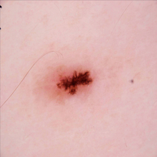
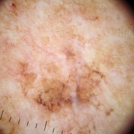

# skin-cancer-detection

Skin cancer is the most common human malignancy, is primarily diagnosed visually, beginning with an initial clinical screening and followed potentially by dermoscopic analysis, a biopsy and histopathological examination. Automated classification of skin lesions using images is a challenging task owing to the fine-grained variability in the appearance of skin lesions.

### Data set [link](https://www.kaggle.com/fanconic/skin-cancer-malignant-vs-benign)

This dataset contains a balanced dataset of images of benign skin moles and malignant skin moles.The data consists of two folders with each 1800 pictures (224x244) of the two types of moles

#### Benign

#### Malignant

